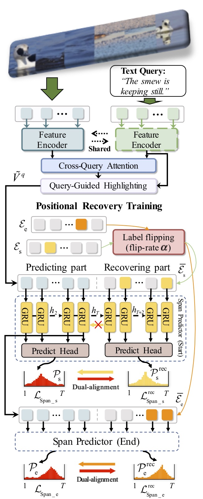

# Prompt When the Animal is: Temporal Animal Behavior Grounding with Positional Recovery Training

This is implementation for the paper "Prompt When the Animal is: Temporal Animal Behavior Grounding with Positional Recovery Training" (**ICMEW 2024**) 
[ArXiv](https://arxiv.org/abs/2405.05523). Our Port is built on top of the classic [VSLNet](https://arxiv.org/abs/2004.13931).

<p align = "center"> 

</p>


## Prerequisites
- python 3.x with pytorch (`1.1.0`), torchvision, opencv-python, moviepy, tqdm, nltk, 
  transformers
- cuda10, cudnn

If you have [Anaconda](https://www.anaconda.com/distribution/) installed, the conda environment of port can be built 
as follow (take python 3.7 as an example):
```shell script
# preparing environment
conda create --name port python=3.7
conda activate port
conda install -c anaconda cudatoolkit=10.0 cudnn
conda install -c anaconda nltk pillow=6.2.1
conda install pytorch==1.1.0 torchvision==0.3.0 cudatoolkit=10.0 -c pytorch
conda install -c conda-forge transformers opencv moviepy tqdm youtube-dl
# download punkt for word tokenizer
python3.7 -m nltk.downloader punkt
```

## Preparation
The details about how to prepare the `Animal Kingdom` features please following the [official website](https://sutdcv.github.io/Animal-Kingdom/Animal_Kingdom/video_grounding/README_video_grounding.html). The legal `data' folder structure is as follows::
```bash
data
├── dataset
│   ├── ak
│   │   ├── ak_vg_duration.json
│   │   ├── test.txt
│   │   ├── train.txt
└── features
    ├── ak
    │   └── new
    |       ├── AABGBPZC.npy
    |       ├── ********.npy
    |       ├── ...
    |       ├── ...
    |       ├── ...
    |
    └── glove.840B.300d.txt
```

The word embeddings `glove.840B.300d.txt` can be accessed from [here](http://nlp.stanford.edu/data/glove.840B.300d.zip).

## Quick Start

**Train** and **Test**
```shell script
# train Port on Animal Kingdom dataset
python main.py --task ak --predictor rnn --mode train
```
Please refer each python file for more parameter settings. You can also download the checkpoints 
from [here](https://drive.google.com/file/d/18ZqEJHhQhChh8v5uMsn109ZyiksPyOh_/view?usp=sharing), and save them to the `./ckpt_t7/` 
directory. More hyper-parameter settings are in the `main.py`.

## Citation
If you feel this project helpful to your research, please cite our work.
```
@article{yan2024prompt,
  title={Prompt When the Animal is: Temporal Animal Behavior Grounding with Positional Recovery Training},
  author={Yan, Sheng and Du, Xin and Li, Zongying and Wang, Yi and Jin, Hongcang and Liu, Mengyuan},
  journal={arXiv preprint arXiv:2405.05523},
  year={2024}
}
```
